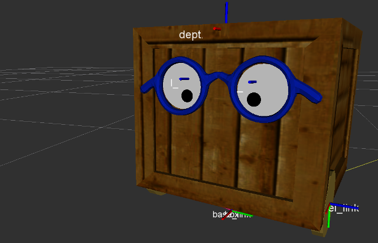

The Ranger robot is developed at EPFL-CHILI

This repository contains the ROS URDF description of the robot.



Usage
------------
To bring URDF model with ROS RVIZ:
```
roslaunch ranger_description display.launch
```
